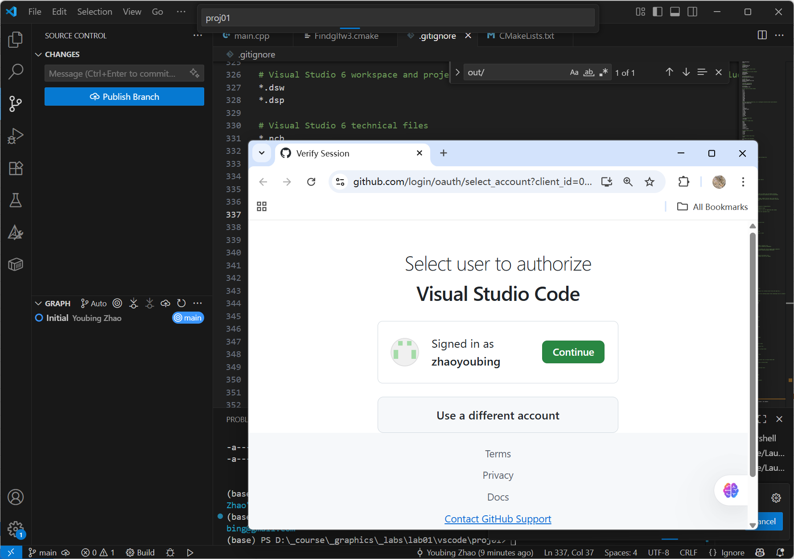
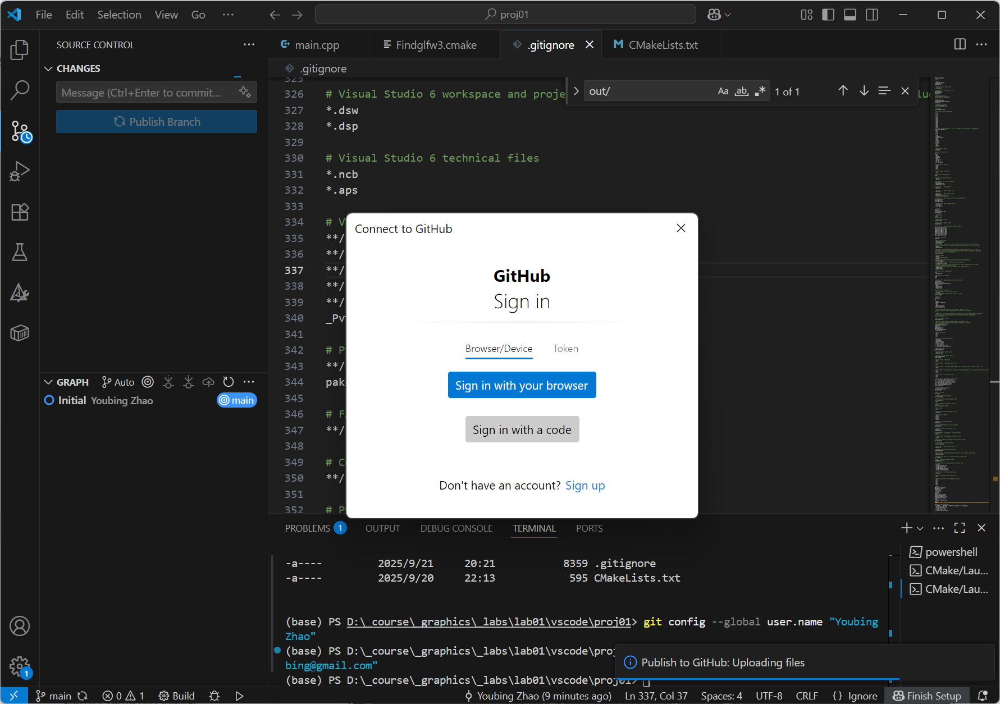

# Visual Studio Code

## Configure your Github account

In VSCode terminal configure your git user name and email

```git
git config --global user.name "YOUR_NAME"
git config --global user.email "YOUR_EMAIL"
```

Use the source control function.

First initilise your project folder to be used as a git repository.

<figure><figcaption></figcaption></figure>

<figure><figcaption></figcaption></figure>

clicking publish branch, you will be asked to login your github account

<figure><figcaption></figcaption></figure>

Authorise VSCode access&#x20;

<figure><figcaption></figcaption></figure>

## Select publishing to a public or pivate repository

<figure><figcaption></figcaption></figure>

## Sign in again

<figure><figcaption></figcaption></figure>

If the publishing is succesful, you can see your project on Github

<figure><figcaption></figcaption></figure>

## Visual Studio

##
