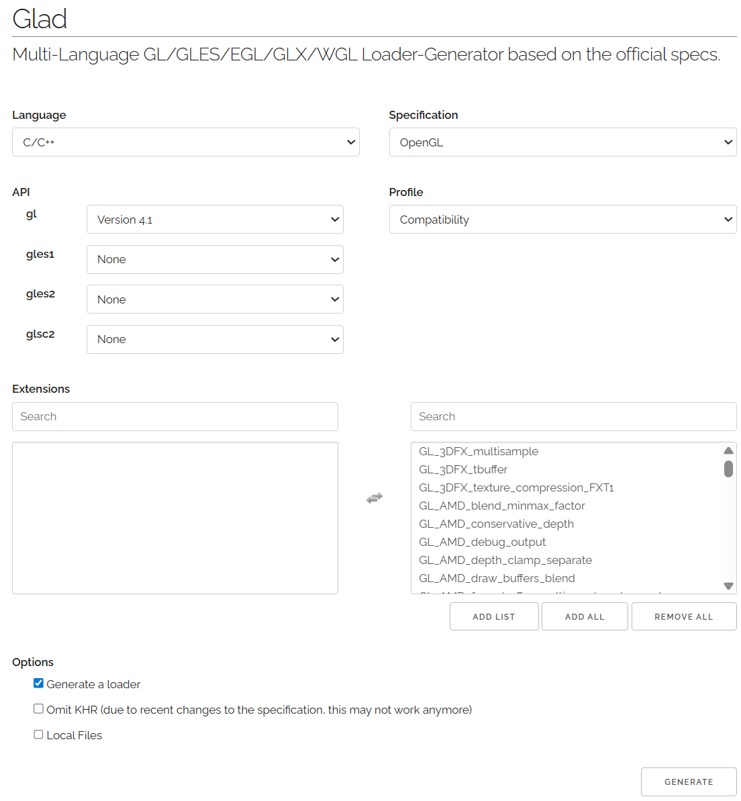
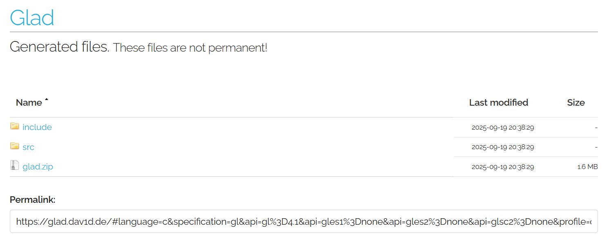

# Step 1 Download external libraries

We also provide GLFW and GLAD download on Blackboard, the following describes how to download them directly from their websites.

## GLFW - OpenGL Windowing

OpenGL renders on the screen but we are using GUIs which is window based. GLFW is the window management libary which supports an OpenGL context as its window content. It is an replacement of the older, outdated GLUT.&#x20;

Download the binaries of glfw3.4 (header files included) from [https://www.glfw.org/download](https://www.glfw.org/download)

For example, if you are using Windows 64bit, download 64-bit Windows binaries of glfw3.4.

Also, download **Findglfw3.cmake** here or from **Blackboard**, which is needed for CMake.&#x20;



## GLAD - OpenGL loader

OpenGL specifies the standard function interface, but the actual available functions on your system depending on your graphics hardware and drivers. GLAD is an OpenGL loader from which binds the actual OpenGL function available. It is a replacement of the ealier GLEW library.&#x20;

Generate glad.c glad.h from  [https://glad.dav1d.de/](https://glad.dav1d.de/)

If you are working on Windows, you are suggested to choose OpenGL 4.6.

If you are working on MacOS you need to set your gl version <= 4.1.&#x20;

If you are working on Linux, to stay on the safe side, it is better to choose gl version <= 4.1.&#x20;

We are setting the profile to Comatibility. Adding all the extensions to the list.

<figure><figcaption></figcaption></figure>

After clicking generate, you will get glad.zip which includes glad.c and glad.h. Download it and save it to your local directory.

<figure><figcaption></figcaption></figure>

