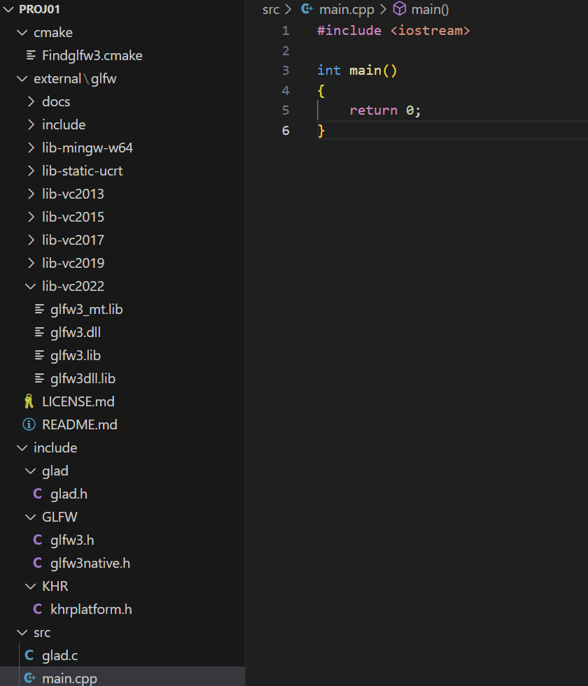

# Step 2 Create the project folder

## Creating the project folder

Create your project folder, such as proj01

## Setting up subdirectories in your project folder

include : for C++ header files

external : for external libraries

src: source files

cmake: for cmake helper files

## Copy external libraries files

#### GLFW

renaming the root project folder glfw-3.4.bin.WIN64 which contains README.md to glfw&#x20;

copy the glfw folder to the external folder

copy glfw/include/GLFW to proj01/include

copy your **Findglfw3.cmake** downloaded from Blackboard to **cmake** folder.

#### GLAD

copy glad/src/glad.c to src

&#x20;copy glad/include/glad and glad/include/KHR to proj01/include

## Open the project folder in VSCode or Visual Studio

Create main.cpp under src, simply put a placeholder main function.

<figure><figcaption></figcaption></figure>

