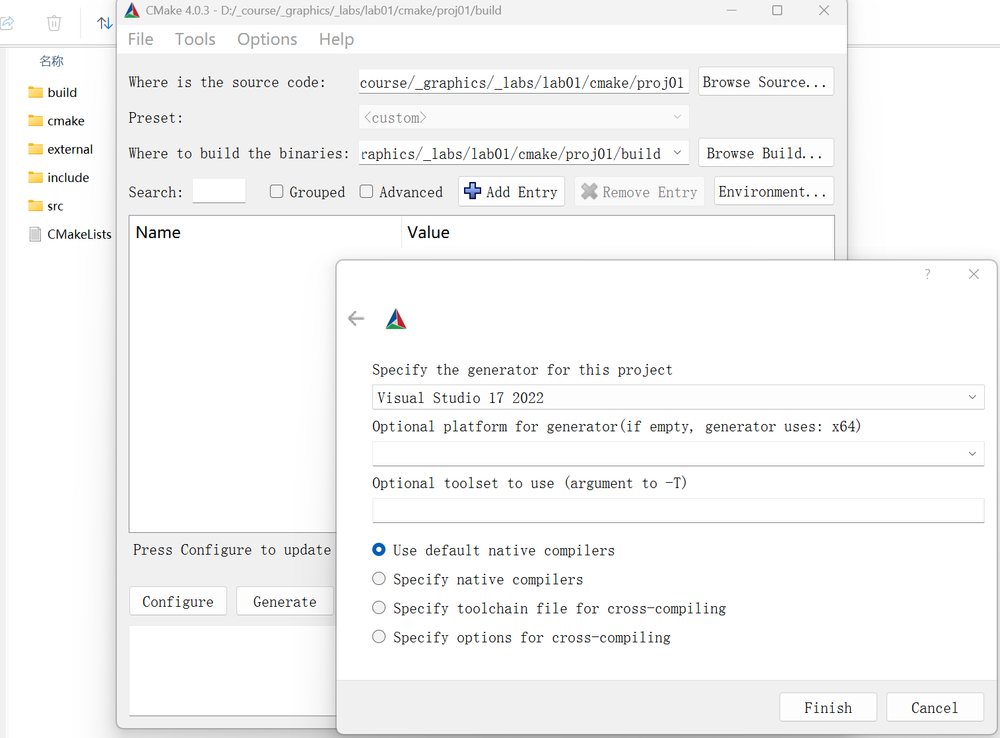
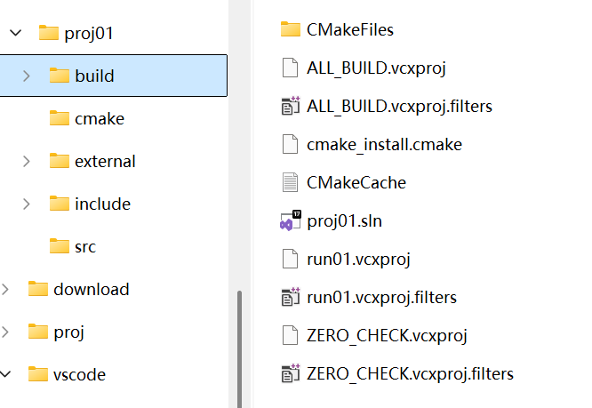
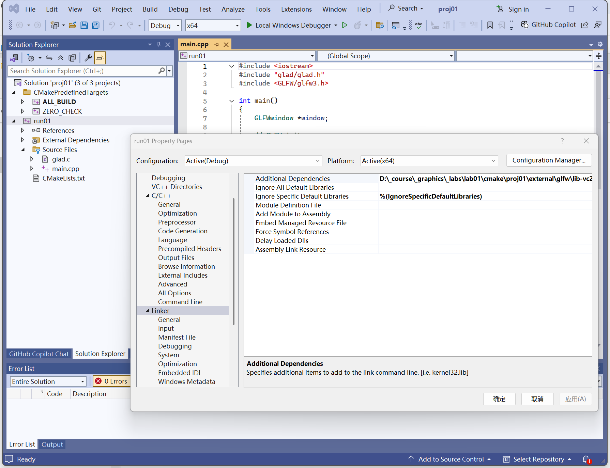

# Step 5 Configure and Build

## VSCode

Use the CMake Tools sidebar to configure, build and run your project is most convenient

## Configure

Click on the configure icon to configure your project.

<figure><figcaption></figcaption></figure>

You may be asked to select your compiler and architecture. In this example we are using Visual Studio 2022 on a 64 bit platform.

You can also select to set the build version to be Debug or Release.

### Build

Click on the Build icon, it will start compiling your project. If successful, the exit code should be 0.

<figure><figcaption></figcaption></figure>

### After building

After building, a build directory appears.

If building is successful, you can see run01.exe in your Debug or Release directory.

<figure><figcaption></figcaption></figure>

### Alternatively, you can use the Command Pallette

Select View->Command Pallette

Type CMake:Build

<figure><figcaption></figcaption></figure>

Select your own compiler

I am using  Visual Studio 2022 with an x64 architecture, so I select Visual Studio 2022 with amd64, or you can choose "Scan for kits"

<figure><figcaption></figcaption></figure>

###

## Visual Studio

Visual Studio supports CMake as well.&#x20;

You can use Visual Studio to directly open the project folder.

When you choose Build->Build All, it will create an out folder and putting all intermediate files in out/build

<figure><figcaption></figcaption></figure>

## CMake-GUI

Instead of the CMake extention in VSCodde, you can also use CMake-GUI to generate your Visual Studio project file.

Use CMake-GUI to open your project folder and specify your build folder.

After clicking on the Configure button, you can select your compiler.

<figure><figcaption></figcaption></figure>

Clicking Configure and Generate, will generate the Visual Studio project file

<figure><figcaption></figcaption></figure>

<figure><figcaption></figcaption></figure>

The project files created are similar to what you have seen in VSCode. You can use Visual Studio to directly open the solution file.

From the project properties, you can see that the include directories, OpenGL and GLFW libraries are all added.

<figure><figcaption></figcaption></figure>
