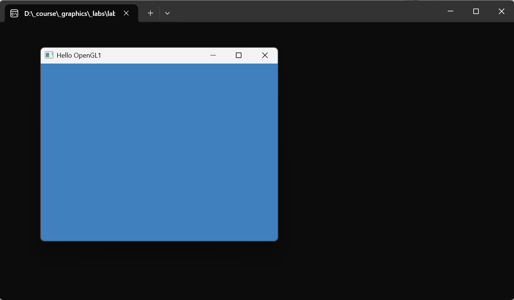
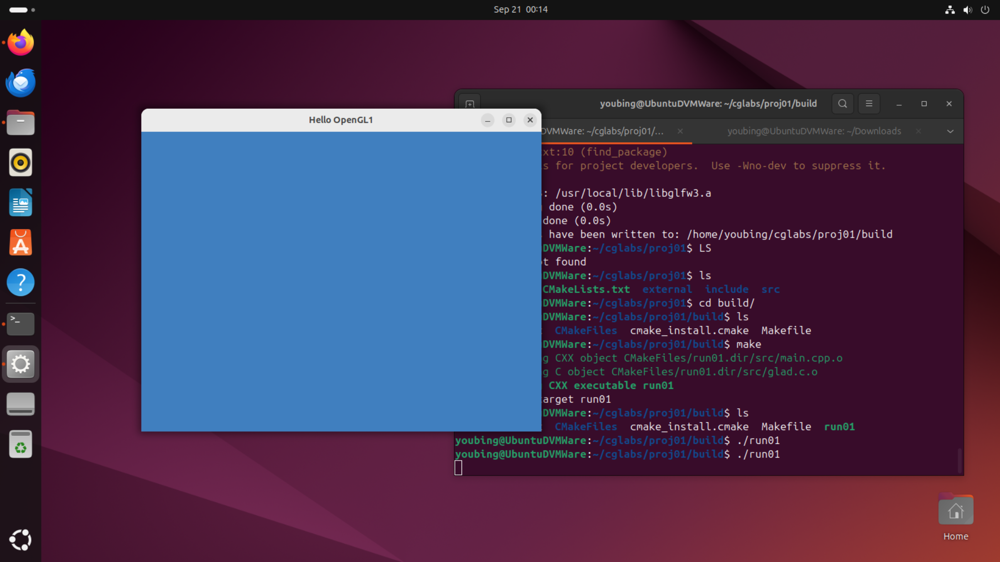

# Step 6 Run

## VSCode

The most convenient way to build and run your program is using the CMake extension panel.

Click on the triangle right to Launch to run your program.

<figure><figcaption></figcaption></figure>

## Visual Studio

directly clicking on the run button (green triangle) or type CTRL+F5, you will run the program.

## Result

If running the program is succesful, you will something similar to the following:

<figure><figcaption></figcaption></figure>

## Crossplatform

With CMake, you can comipile and run your program on multiple platforms.

The following is an example running on Unbuntu.

<figure><figcaption></figcaption></figure>
