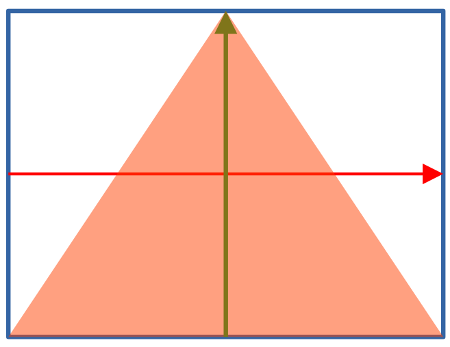

# Step 7 A 2D triangle

## OpenGL default coordinate system

<figure><figcaption></figcaption></figure>

## Triangle data

We like to draw a 2D triangle like the following

<figure><figcaption></figcaption></figure>

The three vertices of the has coordinates of （-1, -1),  (1, -1), (0, 1) in counterclockwise order.

##
