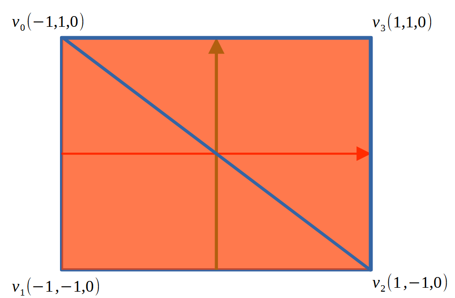

# T2.1 Draw two triangles using vertex indices

## Github code



Now we are drawing two triangles.&#x20;

<figure><figcaption></figcaption></figure>

One way is to use the method in Lab 01 to draw two triangles. However, it is not very efficient as you have to duplicate vertices.

```cpp
    GLfloat verts[] = {
        -1.0f, 1.0f,  // v0
        -1.0f, -1.0f, // v1
        1.0f, -1.0f,  // v2

        1.0f, -1.0f,  // v2
        1.0f, 1.0f,   // v3
        -1.0f, 1.0f,  // v0
    };
```

This week we are going to learn use vertex with indices to draw multiple triangles.
