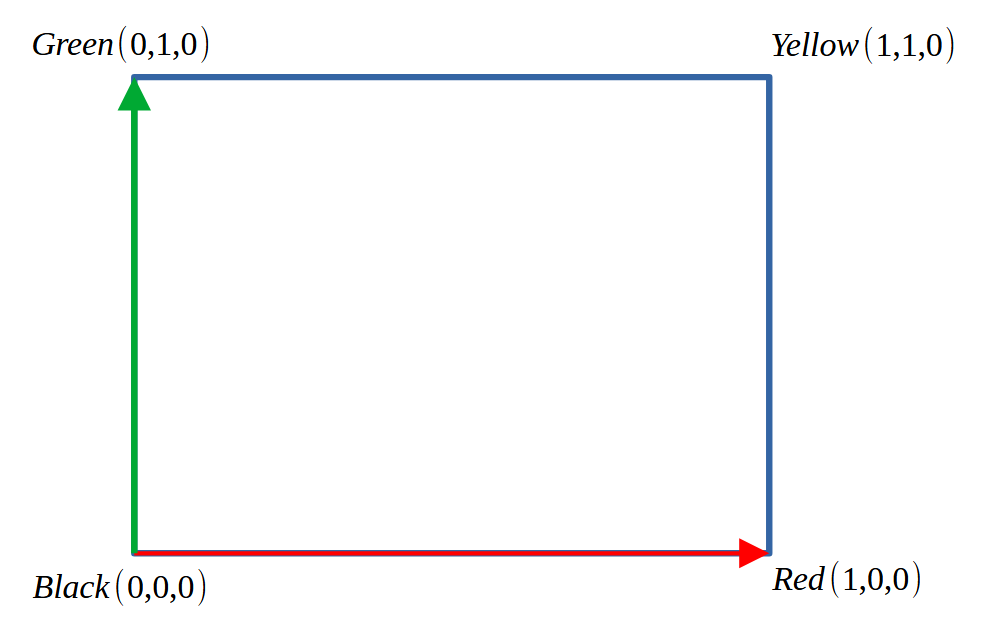

# T2.2 Draw triangles with vertex colours using shaders

## Github code



<figure><figcaption></figcaption></figure>

Taking the X axis as Red and the Y axis as green, we can assign RGB values to each vertex

```cpp
    // vertex data with RGB colour components
    GLfloat verts[] = {
        -1.0f, 1.0f,  0.0f, // v0
        0.0f, 1.0f,  0.0f,  // v0 colour green
        -1.0f, -1.0f, 0.0f, // v1
        0.0f, 0.0f, 0.0f,   // v1 colour black
        1.0f, -1.0f,  0.0f, // v2
        1.0f, 0.0f,  0.0f,  // v2 colour red
        1.0f, 1.0f,   0.0f, // v3
        1.0f, 1.0f,   0.0f, // v3 colour yellow
    };
```

## What we get

<figure><figcaption></figcaption></figure>
