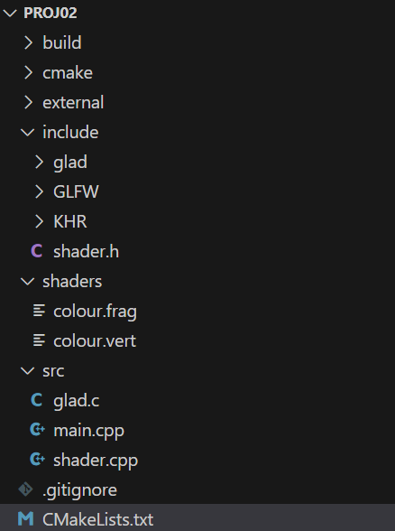

# Adding shader initialiser

## Add the Shader class

Download shader.h and shader.cpp here or from Blackboard





copy shader.h to include/

copy shader.cpp to src/

<figure><figcaption></figcaption></figure>

## Add new files to Git

Also commit the added files to your Git repositories if you are using Git

## class Shader

The Shader class provides methods for shader read, intitialisation, compile, etc.

```cpp
class Shader {
private:
    GLuint vertexshader;      // intermediate shader object
    GLuint fragmentshader;    //    before the linker stage
    GLint compiled_vs = 0;   // compile status
    GLint compiled_fs = 0;   // compile status
    GLint linked = 0;        // link status
public:
    GLuint program;  // the shader program
    std::string vertexshader_source;   // source code
    std::string fragmentshader_source; // source code

    void read_source(const char * vertexshader_filename, const char * fragmentshader_filename);
    void compile();
    GLint getVertexShaderCompileStatus(){return compiled_vs;}
    GLint getFragmentShaderCompileStatus(){return compiled_fs;}
    GLint getLinkStatus(){return linked;}
    
private:
    // Helper functions
    static std::string textFileRead(const char * filename );
    static void programerrors(const GLint program);
    static void shadererrors(const GLint shader);
};

```


&#x20;&#x20;
