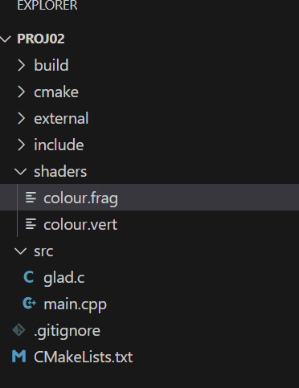

# Create shade folders and files

Add a shaders folder in your project root folder.

Create colour.vert and colour.frag in the shaders folder.

<figure><figcaption></figcaption></figure>

## modify CMakeLists.txt&#x20;

to include shader.cpp as follows

```cmake
# adding source files to our exectuable programs
add_executable(run01 src/main.cpp src/glad.c src/shader.cpp)
```

copy shader files to the build directory

<pre class="language-cmake"><code class="lang-cmake"><strong># copy shaders
</strong>add_custom_target(CopyShaders ALL
	COMMAND ${CMAKE_COMMAND} -E copy_directory
	"${CMAKE_CURRENT_SOURCE_DIR}/shaders"
	"${CMAKE_CURRENT_BINARY_DIR}/shaders"
)

add_dependencies(run01 CopyShaders)
</code></pre>

