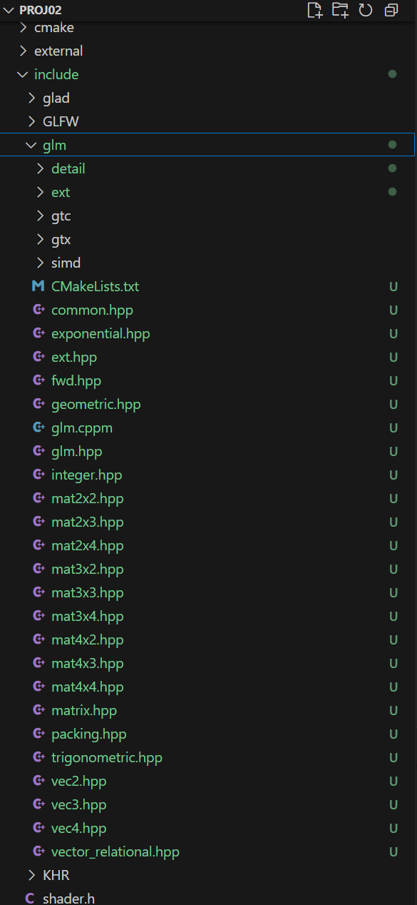

# Download and Install GLM

Download GLM from&#x20;



Unzip it and copy the glm subfolder to the include folder of your project

<figure><figcaption></figcaption></figure>

Commit your changes it you are using Git
