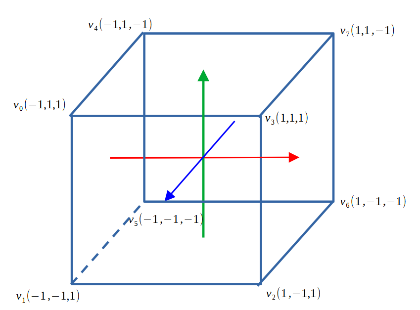

# T2.4 \[opt] Draw a cube and rotate

## Add cube vertices

One cube has 8 vertices. Set the Z value of current 4 vertices to 1.0. Copy the existing 4 vertices and replace its third component with -1.0.&#x20;

It will give us all the 8 vertices needed.

<figure><figcaption></figcaption></figure>

```cpp
    // cube vertex data with RGB colour components
    GLfloat verts[] = {
        -1.0f, 1.0f,  1.0f, // v0
        0.0f, 1.0f,  0.0f,  // v0 colour green
        -1.0f, -1.0f, 1.0f, // v1
        0.0f, 0.0f, 0.0f,   // v1 colour black
        1.0f, -1.0f,  1.0f, // v2
        1.0f, 0.0f,  0.0f,  // v2 colour red
        1.0f, 1.0f,   1.0f, // v3
        1.0f, 1.0f,   0.0f, // v3 colour yellow

        -1.0f, 1.0f, -1.0f, // v4
        0.0f, 1.0f,  1.0f,  // v4 colour cyan
        -1.0f, -1.0f, -1.0f, // v5
        0.0f, 0.0f, 1.0f,   // v5 colour blue
        1.0f, -1.0f,  -1.0f, // v6
        1.0f, 0.0f,  1.0f,  // v6 colour magenta
        1.0f, 1.0f,  -1.0f, // v7
        1.0f, 1.0f,  1.0f, // v7 colour white
    };

```

## Colour assignment

The colour assignment as as follows

<figure><figcaption></figcaption></figure>

## Set indices of triangles

```cpp
    // indices of 12 triangles of a cube
    GLuint indices[] = { 
        0, 1, 2,  0, 2, 3,
        1, 5, 2,  5, 6, 2,
        0, 3, 4,  4, 3, 7,
        3, 2, 7,  2, 6, 7,
        1, 0, 4,  1, 4, 5,
        7, 6, 4,  4, 6, 5
    };
```

in drawTriangles() change the number of vertices you are going to draw

```cpp
    // draw triangle using indices
    glDrawElements(GL_TRIANGLES, 12 * 3, GL_UNSIGNED_INT, 0);
```

## enable depth test in main()

add glEnable(GL\_DEPTH\_TEST)

add GL\_DEPTH\_BUFFER\_BIT in glClear()

```cpp
    initTriangle();

    // setting the background colour, you can change the value
    glClearColor(0.25f, 0.5f, 0.75f, 1.0f);
    
    glEnable(GL_DEPTH_TEST);

    // setting the event loop
    while (!glfwWindowShouldClose(window))
    {
        glfwPollEvents();

        glClear(GL_COLOR_BUFFER_BIT | GL_DEPTH_BUFFER_BIT);

        drawTriangle();

        glfwSwapBuffers(window);
    }

```

Set the orthographic projection matrix

To show hidden surface correctly, we need to set up a basic orthographics projeciton matrix

Add projection matrix uniform in colour.vert and and use that to calcuate gl\_Position

```glsl
#version 410

in layout(location=0) vec3 pos;
in layout(location=1) vec3 colour_in;

// transformation in the world and camera space
uniform mat4 modelview;
uniform mat4 projection;

out vec3 colour_vert;

void main()
{
    // homogeneous coordinate
    gl_Position = projection * modelview * vec4(pos, 1.0); 
    colour_vert = colour_in;
}
```

Connect the projection matrix to your glm orthographic matrix at the end of initTriangle()

```cpp
    glm::mat4 mat_projection = glm::ortho(-1.0f, 1.0f, -1.0f, 1.0f, -1.0f, 1.0f);
    
    GLuint modelview_loc = glGetUniformLocation( shader.program, "modelview" );
    glUniformMatrix4fv(modelview_loc, 1, GL_FALSE, &mat_modelview[0][0]);

    // you must set the orthographic projection to get correct rendering with depth
    GLuint projection_loc = glGetUniformLocation( shader.program, "projection" );
    glUniformMatrix4fv(projection_loc, 1, GL_FALSE, &mat_projection[0][0]);
```

Now you can see

<figure><figcaption></figcaption></figure>

Play it with scale, rotation and translation.&#x20;

The following is scale by 0.5, rotate around Y axis by 45 degrees and then rotate around X axis by 30 degrees, as shown in the code

```cpp
    glm::mat4 mat_scale = glm::scale(glm::vec3(0.5f, 0.5f, 0.5f));
    glm::mat4 mat_rot = glm::rotate(glm::radians(45.0f), glm::vec3(0.0f, 1.0f, 0.0f));
    glm::mat4 mat_rot2 = glm::rotate(glm::radians(30.0f), glm::vec3(1.0f, 0.0f, 0.0f));

    // the order matters
    glm::mat4 mat_modelview =   mat_rot2 * mat_rot * mat_scale;
```

<figure><figcaption></figcaption></figure>
