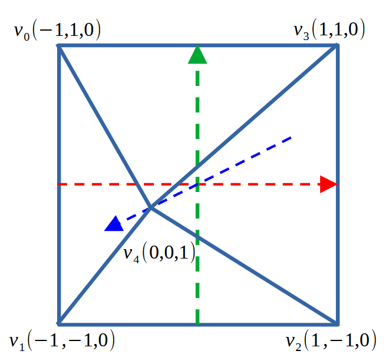

# T2.5 \[opt] Pyramid and interactive rotation with keyboard

We can also draw a pyramid

<figure><figcaption></figcaption></figure>

## Pyramid data

```cpp
    // pyramid vertex data with RGB colour components
    GLfloat verts[] = {
        -1.0f, 1.0f,  0.0f, // v0
        0.0f, 1.0f,  0.0f,  // v0 colour green
        -1.0f, -1.0f, 0.0f, // v1
        0.0f, 0.0f, 0.0f,   // v1 colour black
        1.0f, -1.0f,  0.0f, // v2
        1.0f, 0.0f,  0.0f,  // v2 colour red
        1.0f, 1.0f,   0.0f, // v3
        1.0f, 1.0f,   0.0f, // v3 colour yellow

        0.0f, 0.0f, 1.0f, // v4
        0.0f, 0.0f, 1.0f,  // v4 colour blue
    };
    
    // indices of 6 triangles of a pyramid
    GLuint indices[] = { 
        0, 1, 2,  0, 2, 3, //base
        4, 0, 1,
        4, 1, 2,
        4, 2, 3,
        4, 3, 0
    };
```

you will get

<figure><figcaption></figcaption></figure>

## GLFW key\_callback

Write GLFW key call back in main.cpp to interactively change rotation angles

```cpp
float rot_x = 0;
float rot_y = 0;
void key_callback(GLFWwindow* window, int key, int scancode, int action, int mods)
{
    if (key == GLFW_KEY_LEFT ) {
        rot_y -= 5.0;
    } else if (key == GLFW_KEY_RIGHT /*&& action == GLFW_PRESS*/) {
        rot_y += 5.0;
    } if (key == GLFW_KEY_DOWN ) {
        rot_x += 5.0;
    } else if (key == GLFW_KEY_UP) {
        rot_x -= 5.0;
    }

    glm::mat4 mat_scale = glm::scale(glm::vec3(0.5f, 0.5f, 0.5f));
    glm::mat4 mat_rot_y = glm::rotate(glm::radians(rot_y), glm::vec3(0.0f, 1.0f, 0.0f));
    glm::mat4 mat_rot_x = glm::rotate(glm::radians(rot_x), glm::vec3(1.0f, 0.0f, 0.0f));

    glm::mat4 mat_modelview =  mat_rot_x * mat_rot_y * mat_scale;
    
    GLuint modelview_loc = glGetUniformLocation( shader.program, "modelview" );
    glUniformMatrix4fv(modelview_loc, 1, GL_FALSE, &mat_modelview[0][0]);
}
```

## Set key\_callback

In main(), add one line after glfw window creation

```cpp
    // create a GLFW window
    window = glfwCreateWindow(640, 640, "Hello OpenGL 2", NULL, NULL);
    glfwMakeContextCurrent(window);

    // register the key event callback function
    glfwSetKeyCallback(window, key_callback);
```

Now you can play rotating the pyramid with the arrow keys.

<figure><figcaption></figcaption></figure>
