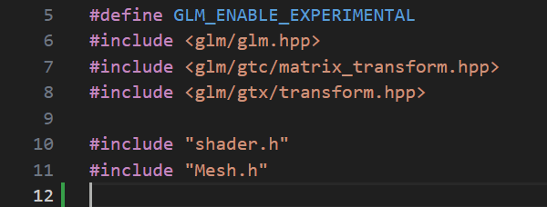

# 3.1.5 Use class Mesh to Draw a Model

in main.cpp, first include mesh.h

<figure><figcaption></figcaption></figure>


## Add a function initShader()

```cpp
// Initialize shader
void initShader(std::string pathVert, std::string pathFrag) 
{
    shader.read_source( pathVert.c_str(), pathFrag.c_str());

    shader.compile();
    glUseProgram(shader.program);
}
```


## Call initShader() and new a Mesh object in main()

comment out initTriangle(),  add the following before that

### initShader()

```cpp
// use the following if you are using Visual Studio
// initShader( "shaders/colour.vert", "shaders/colour.frag");
initShader("../shaders/colour.vert", "../shaders/colour.frag");
```

### new a Mesh

After that new a Mesh objet and use it to load your model.

You need to use your own path of your model.

```cpp
    initShader( "shaders/colour.vert", "shaders/colour.frag");

    std::shared_ptr<Mesh> pMesh = std::make_shared<Mesh>();
    pMesh->init("models/teapot.obj");


    //initTriangle();
```

## Call pMesh->draw()

In the main GLFW rendering loop, replace drawTriangle() with Mesh::draw()

```cpp
    while (!glfwWindowShouldClose(window))
    {
        glfwPollEvents();

        glClear(GL_COLOR_BUFFER_BIT | GL_DEPTH_BUFFER_BIT);

        // drawTriangle();
        pMesh->draw();

        glfwSwapBuffers(window);
    }
```

Now you are going to see a teapot like this&#x20;

<figure><figcaption></figcaption></figure>

## Full Source Code

```cpp
#include <iostream>
#include <glad/glad.h>
#include <GLFW/glfw3.h>

#define GLM_ENABLE_EXPERIMENTAL
#include <glm/glm.hpp>
#include <glm/gtc/matrix_transform.hpp>
#include <glm/gtx/transform.hpp>

#include "shader.h"
#include "Mesh.h"

#include "Node.h"

static Shader shader;

// Initialize shader
void initShader(std::string pathVert, std::string pathFrag) 
{
    shader.read_source( pathVert.c_str(), pathFrag.c_str());

    shader.compile();
    glUseProgram(shader.program);
}

int main()
{
    GLFWwindow *window;

    // GLFW init
    if (!glfwInit())
    {
        std::cout << "glfw failed" << std::endl;
        return -1;
    }

    // create a GLFW window
    window = glfwCreateWindow(640, 640, "Hello OpenGL 3", NULL, NULL);
    glfwMakeContextCurrent(window);


    // loading glad
    if (!gladLoadGLLoader((GLADloadproc)glfwGetProcAddress))
    {
        std::cout << "Couldn't load opengl" << std::endl;
        glfwTerminate();
        return -1;
    }

    initShader( "shaders/colour.vert", "shaders/colour.frag");

    // loading mesh models
    std::shared_ptr<Mesh> pMesh = std::make_shared<Mesh>();
    
    // load the model
    pMesh->init("models/teapot.obj", shader.program);

    // setting the background colour, you can change the value
    glClearColor(0.25f, 0.5f, 0.75f, 1.0f);
    
    glEnable(GL_DEPTH_TEST);

    // setting the event loop
    while (!glfwWindowShouldClose(window))
    {
        glfwPollEvents();

        glClear(GL_COLOR_BUFFER_BIT | GL_DEPTH_BUFFER_BIT);

        // drawTriangle();
        pMesh->draw();

        glfwSwapBuffers(window);
    }

    glfwTerminate();

    return 0;
}
```
