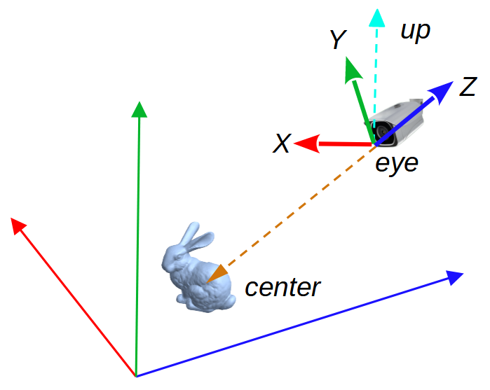

# T 4.3 Camera Control

## The Camera Frame

The Camera's frame has its origin locate at the eye/camera position, looking towards the -Z direction. Its Y axis points to the up direction and X axis points to the right hand side.

<figure><figcaption></figcaption></figure>

In following sections, examples will be given to demonstrate how to achieve camera rotation along the Y (pan) and X axis (tilt) as well as translation along the camera Z axis (zoom in/out) and world axis.

At the beginning of **key\_callback**() in main.cpp , we set the increment steps for our angles and translations. Also we use a tempory variable **mat** to present the step transformation applied to our view matrix.

```cpp
    glm::mat4 mat = glm::mat4(1.0);

    float angleStep = 5.0f;
    float transStep = 1.0f;
```

## Camera Control

Common camera control include pan, tilt and zoom. Among the three, pan and tilt can be interpreted as local rotations and zoom can be interpreted as translations along its Z axis. All of the three transforms are relative to the camera space.

## Pan

A camera **Pan** is to rotate the camera in a leftward and rigthward way, which is a rotation of $$\theta_y$$ around Y axis (pan left is a CCW rotation with a positive angle and pan right is a CW rotation with a negavtive angle).

We have learned from the lecture that:

$$\mathbf{V'} = R_{pan}({-\theta_y}) \mathbf{V}$$

We write this in our key event processing code

```cpp
if (GLFW_KEY_LEFT == key) {
    // pan left, rotate around Y, CCW
    mat = glm::rotate(glm::radians(-angleStep), glm::vec3(0.0, 1.0, 0.0));
    matView = mat * matView;
} else if (GLFW_KEY_RIGHT == key ) {
    // pan right, rotate around Y, CW
    mat = glm::rotate(glm::radians(angleStep), glm::vec3(0.0, 1.0, 0.0));
    matView = mat * matView;
} 
```

## Tilt

A camera **Tilt** is to rotate the camera in a upward and downward way, which is a rotation of $$\theta_x$$ (tilt up is a CCW rotation with a positive angle and tilt down is a CW rotation with a negavtive angle).

We have learned that, similar to the pan angle, we have:

$$\mathbf{V'} = R_{tilt}({-\theta_x}) \mathbf{V}$$

```cpp
if (GLFW_KEY_UP == key) {
    // tilt up, rotate around X, CCW
    mat = glm::rotate(glm::radians(-angleStep), glm::vec3(1.0, 0.0, 0.0));
    matView = mat * matView;
} if (GLFW_KEY_DOWN == key) {
    // tilt down, rotate around X, CW
    mat = glm::rotate(glm::radians(angleStep), glm::vec3(1.0, 0.0, 0.0));
    matView = mat * matView;
}
```

## Zoom In/Out

A camera zoom is not a rotation but a translation along its own Z axis. A zoom in is to move  a negative distance along its camera frame Z axis. A zoom out is to move a posive distance $$d$$ along its camera frame Z axis.

From what we learned in the lecture, we know that a translation relative to the camera frame is:

$$\mathbf{V}' = \mathbf{T}(-t_x, -t_y, -t_z) \mathbf{V}$$

Accodingly, we have the following code

```cpp
if ( (GLFW_KEY_KP_ADD == key) || 
            (GLFW_KEY_EQUAL == key) && (modes & GLFW_MOD_SHIFT) ) {
    // zoom in, move along -Z
    mat = glm::translate(glm::mat4(1.0f), glm::vec3(0.0f, 0.0f, transStep));
    matView = mat * matView ;
} else if ( (GLFW_KEY_KP_SUBTRACT == key ) || (GLFW_KEY_MINUS == key) ) {
    // std::cout << "keypad - pressed" << std::endl;
    // zoom out, move along -Z
    mat = glm::translate(glm::mat4(1.0f), glm::vec3(0.0f, 0.0f, -transStep));
    matView = mat * matView;
}
```

## Camera's Translation in the World Space

Camera's translation in the world space can be achieved via:

$$\mathbf{V}' = \mathbf{V}  \mathbf{T}(-t_x, -t_y, -t_z)$$

You can try it by yoursel.

## Reset

Finally we need a reset function to reset the modelling and view matrices. I am choosing press "r" triggers that.

```cpp
if (GLFW_KEY_R == key) {
    // reset
    matView = glm::lookAt(glm::vec3(0, 0, 5), glm::vec3(0, 0, 0), glm::vec3(0, 1, 0)); 
    matModelRoot = glm::mat4(1.0f);
}
```

## Result

Example: panning left followed by tilting up.

<figure><figcaption></figcaption></figure>

