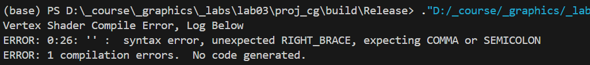
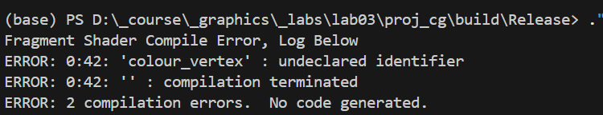

# Debugging Shaders

We may have bugs in our shader programs.

During the running, the main C++ program will compile our shader programs and report error.

Don't panic when you see your program stops and reports erros about shaders.

For example:

<figure><figcaption></figcaption></figure>

And this:

<figure><figcaption></figcaption></figure>

The shader compiler will tell you the location (the line number and offset) of the error with a description.

Try to use the description as a reference to fix your bug.
