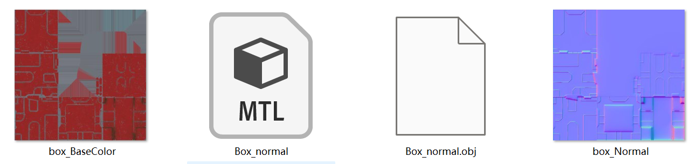

# Lab A08 Normal Mapping

## Scaffold Project to start with (Box\_normal model included)

[https://github.com/zhaoyoubing/proj02/tree/LabA08\_normalmap\_start](https://github.com/zhaoyoubing/proj02/tree/LabA08_normalmap_start)

With this scaffold project, you only need to work on Mesh.cpp and two shaders: normalmap.vert and normalmap.frag.

## The Box\_normal model



Unzip the file and copy all the four files to your models directory, including:

Box\_normal.obj

Box\_normal.mtl

box\_BaseColor.png (diffuse texture map)

box\_Normal.png (normal map)

<figure><figcaption></figcaption></figure>

<figure><figcaption></figcaption></figure>

## More Mapping

### Skybox


