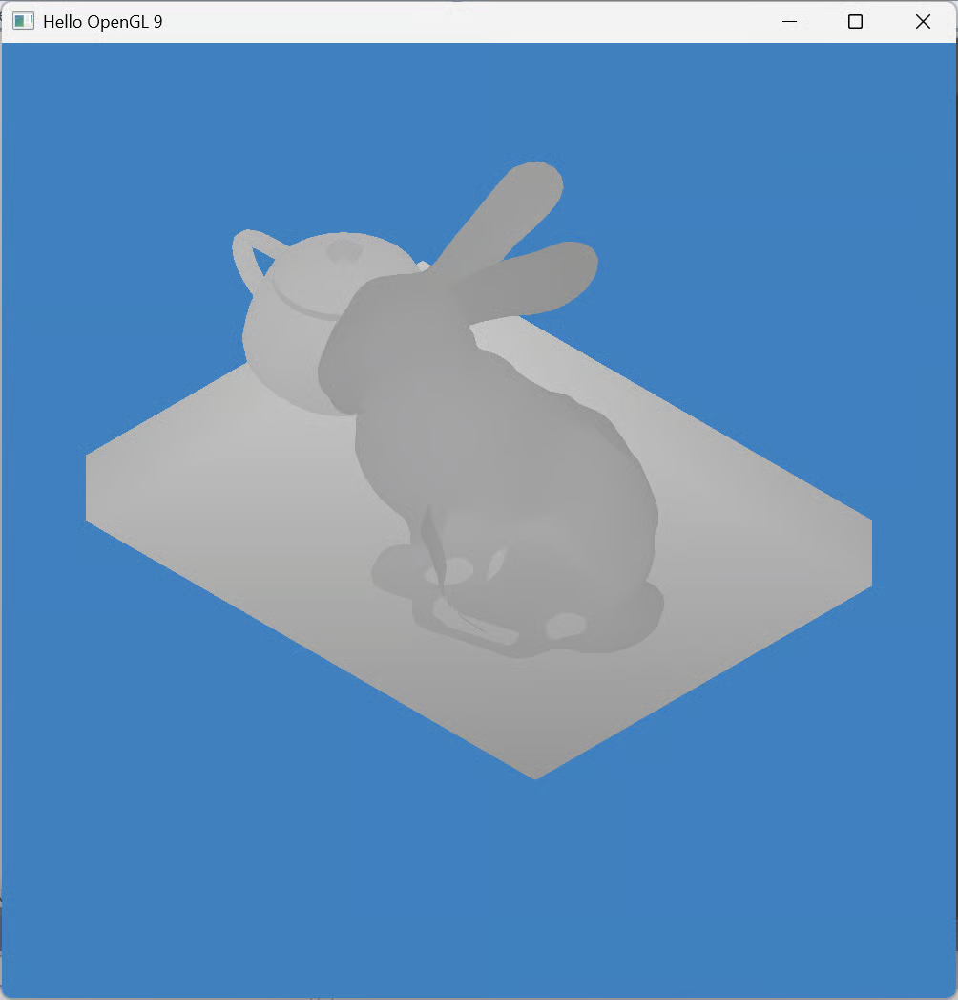

# LabA09 Shadow Maps

## Scaffold Project to Start with



With this scaffold project, you only need to work on the following files:

<mark style="color:red;">shaders/</mark><mark style="color:red;">**shadowmap.vert**</mark> <mark style="color:red;"></mark> <mark style="color:red;"></mark><mark style="color:red;">shaders/</mark><mark style="color:red;">**shadowmap.frag**</mark> <mark style="color:red;">**main.cpp**</mark>

Search those files with "**TODO**" to find parts that you need to work on.

<figure><figcaption></figcaption></figure>

The Shadow Map (front face culling)

<figure><figcaption></figcaption></figure>

