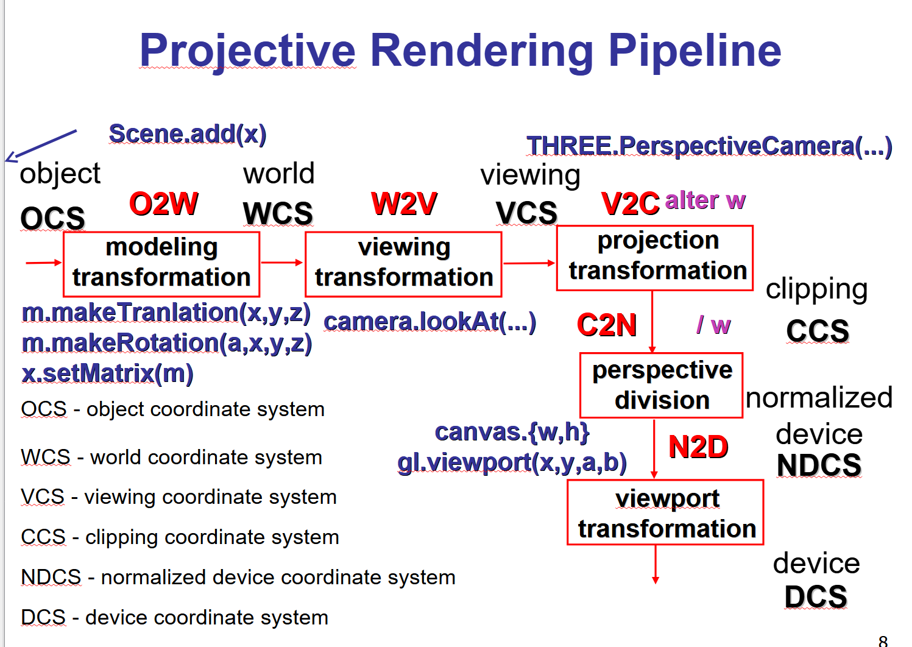

# Notes

## Lighting

{% embed url="https://en.wikipedia.org/wiki/Oren%E2%80%93Nayar_reflectance_model" %}





[https://people.computing.clemson.edu/\~ekp/courses/dpa8090/](https://people.computing.clemson.edu/~ekp/courses/dpa8090/)



[https://www.adobe.com/learn/substance-3d-designer/web/the-pbr-guide-part-1?learnIn=1](https://www.adobe.com/learn/substance-3d-designer/web/the-pbr-guide-part-1?learnIn=1)

cmake\_minimum\_required(VERSION 3.14) project(MyApp)



##

## Set up your executable

add\_executable(MyApp src/main.cpp)

## Add glad

add\_library(glad STATIC external/glad/glad.c) target\_include\_directories(glad PUBLIC external/glad/include)

## Link glad to your app

target\_link\_libraries(MyApp PRIVATE glad)

#### WebGL startup example



<figure><figcaption></figcaption></figure>

<figure><figcaption></figcaption></figure>

